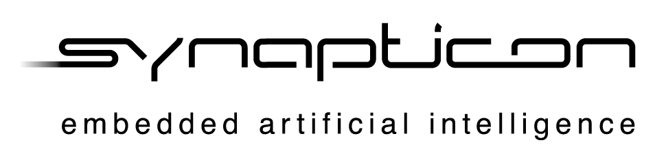

====================
CODING GUIDE xC
====================

Version 1.0

SYNAPTICON

--------------

Document Change Log
===================

+-------------------------+-------------------------+-------------------------+
| Description             | Name                    | Date                    |
+-------------------------+-------------------------+-------------------------+
| Start of document       | Levent Yildirim         | 21/06/2015              |
+-------------------------+-------------------------+-------------------------+
| Major Adaption          | David Bensoussan        | 2015-08-03              |
+-------------------------+-------------------------+-------------------------+
| Fixed Layout            | Frank Jeschke           | 2015-07-08              |
+-------------------------+-------------------------+-------------------------+
| Fixed Language          | Thiago de Freitas       | 2017-07-24              |
+-------------------------+-------------------------+-------------------------+

--------------

Table Of Content

.. contents::

--------------

Content
=======

This document is the official ``XMOS coding guideline`` of Synapticon GmbH. All
developments, which are done by Synapticon or are done by third party
for Synapticon has to follow this coding guideline. This coding
guideline covers the xC programming language.

Header files
============

Self-contained Headers
----------------------

XMOS uses ``#pragma once``

Function Parameter Ordering
---------------------------

Interfaces and channels come first. Ports come second. All of their arguments follow
like described in the C/C++ guideline.

Naming
============

Channels
---------------------------

Channel instace names should start by ``c_``

For example
::
	
	c_watchdog
	
Interfaces
---------------------------

Interface instance names should start by ``i_``

For example
::
	
	i_watchdog
